## Serverless con AWS - Conceptos

🤔 ### **¿Qué es Serverless?** 

>  *Serverless es una forma de ejecutar servicios en la nube sin necesidad de administrar servidores. En lugar de mantener una infraestructura activa todo el tiempo, las funciones o servicios se ejecutan solo cuando ocurre un evento, lo que permite escalar automáticamente y pagar únicamente por lo que se utiliza. Es ideal para arquitecturas orientadas a eventos y microservicios.* 

---

## ✅ Conceptos a tener en cuenta

### 1. AWS Lambda

- **Qué es**: Funciones que se ejecutan sin servidor. No administrás infraestructura.
- **Casos de uso**: Procesar eventos (subida a S3, mensaje en SQS, endpoint de API Gateway).
- **Ventajas**: Escalado automático, pago por uso, sin mantenimiento de infraestructura.
- **Ejemplo**: Subida de archivo en S3 → Lambda procesa imagen.

    >💡 *Una Lambda permite ejecutar lógica de backend sin preocuparnos por servidores. Es ideal para eventos puntuales y escalabilidad automática.*

#### Mermaid
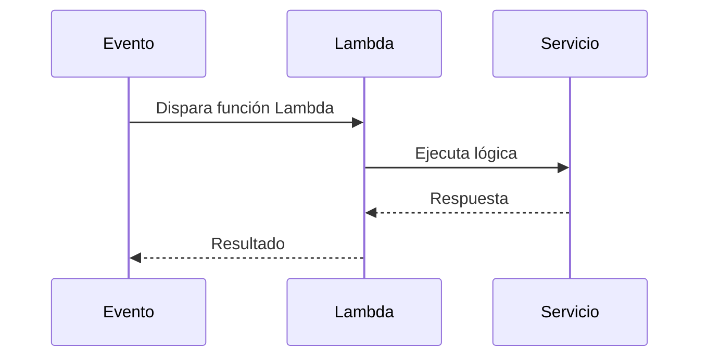

#### Diagrama
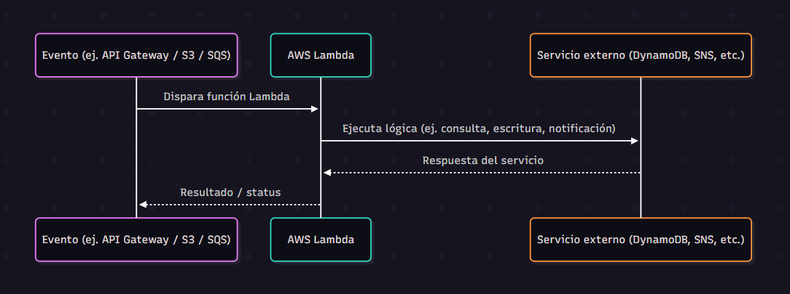

### 2. API Gateway

- **Qué es**: Servicio para exponer Lambdas como endpoints HTTP.
- **Casos de uso**: APIs REST/HTTP, validación, autenticación, logging.
- **Ventajas**: Integración sencilla con Lambda, manejo de autenticación, escalabilidad.
- **Ejemplo**: Recibir una petición HTTP → API Gateway valida y redirige a una Lambda.

    >💡 *API Gateway permite crear APIs seguras y escalables, conectando fácilmente clientes HTTP con funciones Lambda.*

#### Mermaid

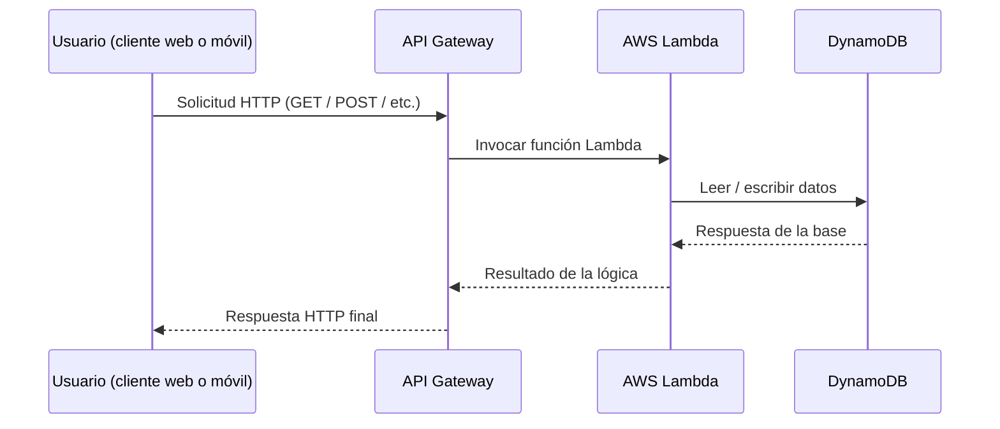
#### Diagrama
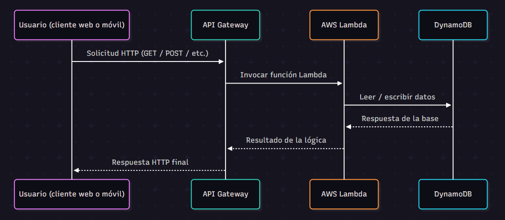

### 3. SQS (Simple Queue Service)

- **Qué es**: Cola de mensajes FIFO o standard.
- **Casos de uso**: Desacoplar productores/consumidores, procesamiento en background.
- **Ventajas**: Retry automático, procesamiento asíncrono, resiliencia.
- **Ejemplo**: Servicio web envía tarea pesada a SQS → Lambda consume mensajes y procesa en background.

    >💡 *SQS ayuda a desacoplar servicios y manejar cargas variables, asegurando que las tareas se procesen sin perder mensajes.*

#### Mermaid
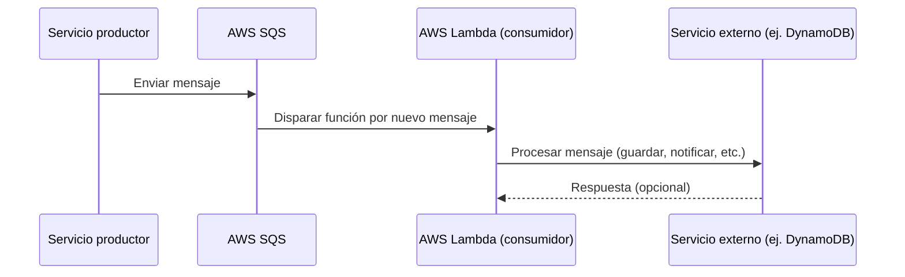
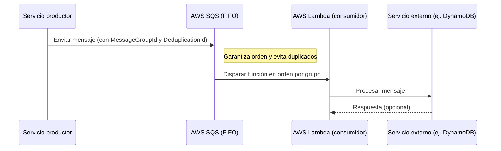
#### Diagrama
##### a. SQS Standard
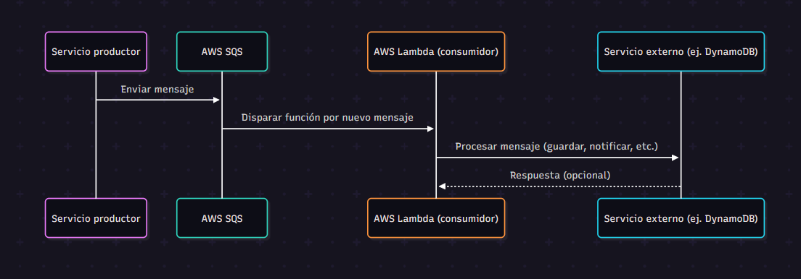

##### b. SQS FIFO
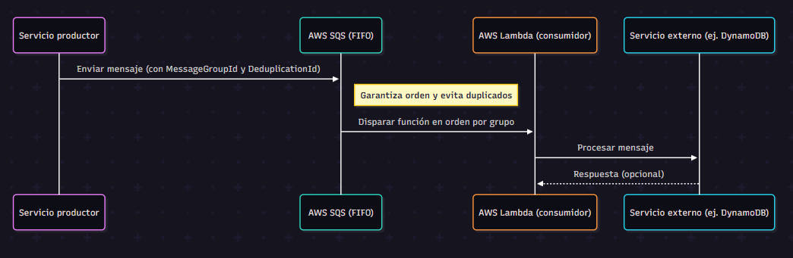

### 4. SNS (Simple Notification Service)

- **Qué es**: Sistema pub/sub para notificaciones.
- **Casos de uso**: Enviar un mensaje a múltiples destinos (Lambda, SQS, Email).
- **Ventajas**: Simplicidad, broadcast de eventos.
- **Ejemplo**: Evento importante → SNS notifica por email y dispara una Lambda en paralelo.

    >💡 *SNS permite notificar múltiples sistemas ante un mismo evento, facilitando la comunicación y el broadcast de mensajes.*

#### Mermaid
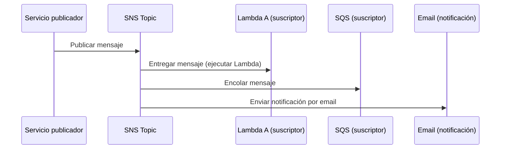
#### Diagrama
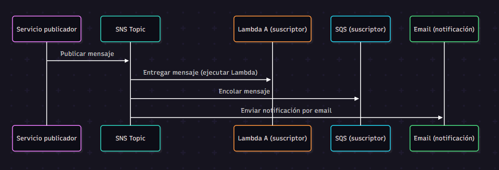

### 5. Step Functions

- **Qué es**: Servicio para orquestar flujos de tareas.
- **Casos de uso**: Procesos con múltiples pasos, lógica condicional, retries.
- **Ventajas**: Separación de lógica de control, visibilidad del flujo, reintentos.
- **Ejemplo**: Proceso de registro de usuario → Step Functions coordina varias Lambdas (validación, guardado, notificación).

    >💡 *Step Functions permiten definir procesos complejos entre Lambdas, separando la lógica de control y facilitando la orquestación.*

#### Mermaid
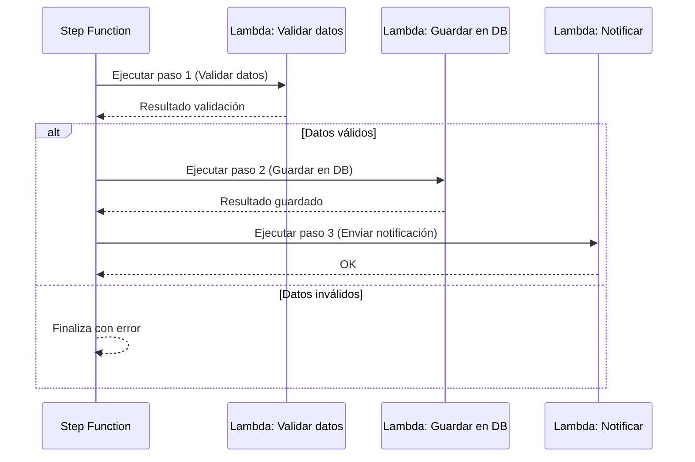
#### Diagrama
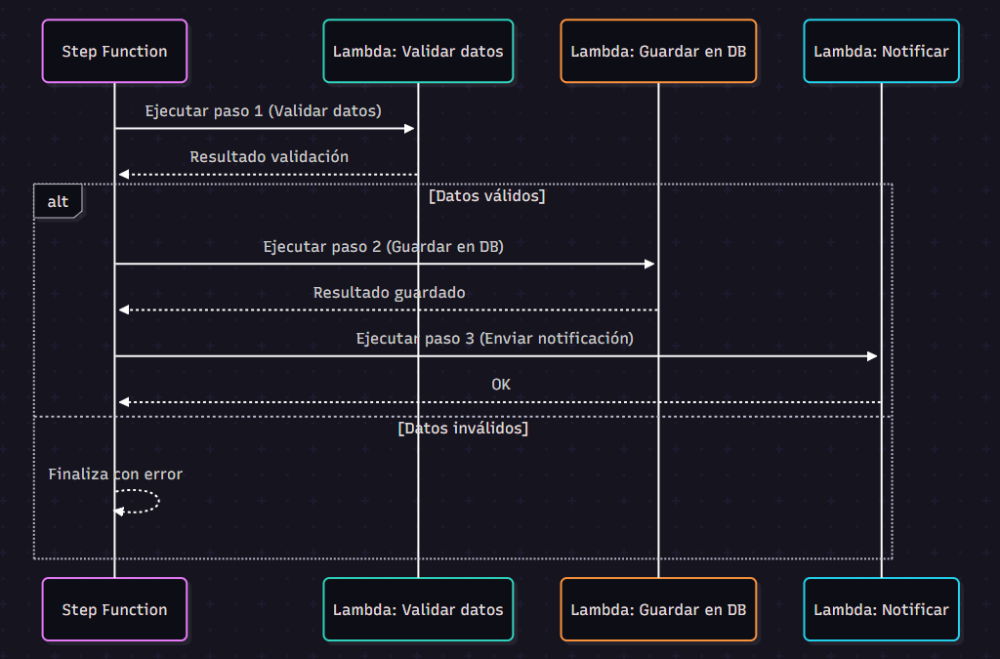

### 6. DynamoDB

- **Qué es**: Base de datos NoSQL totalmente gestionada.
- **Casos de uso**: Alta velocidad de lectura/escritura, sin relaciones complejas.
- **Ventajas**: Escalabilidad automática, baja latencia, TTL, streams.
- **Ejemplo**: Aplicación serverless almacena sesiones de usuario en DynamoDB para acceso rápido.

    >💡 *DynamoDB es ideal cuando se necesita velocidad y escalabilidad, con una estructura simple de datos y sin preocuparse por la administración de la base.*

#### Mermaid
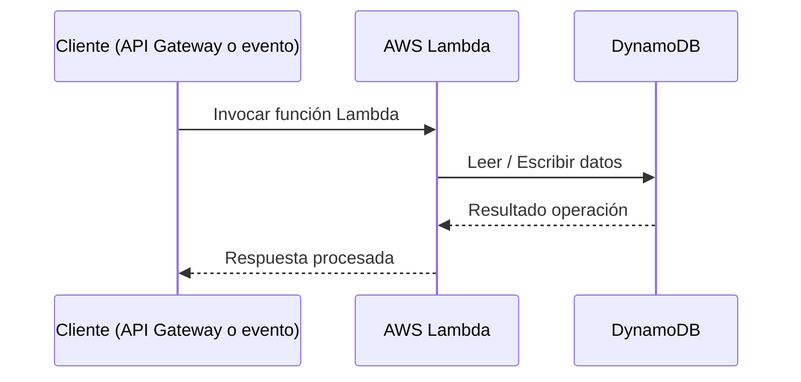
#### Diagrama
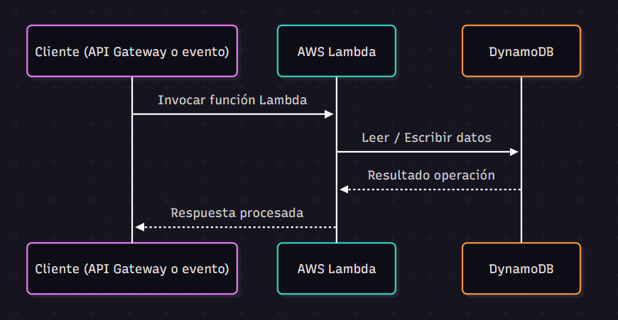

### 7. Serverless Framework

- **Qué es**: Framework de infraestructura como código para desplegar servicios serverless en AWS y otros proveedores.
- **Casos de uso**: Crear y desplegar Lambdas, API Gateway, SQS, DynamoDB, todo desde archivos YAML.
- **Ventajas**: Automatización, reutilización, despliegues rápidos y consistentes.
- **Ejemplo**: Definir funciones Lambda y recursos en YAML → Desplegar todo con un solo comando.

    >💡 *Serverless Framework permite definir y desplegar infraestructura y funciones serverless de forma sencilla y repetible, facilitando la automatización y el versionado.*

#### Mermaid
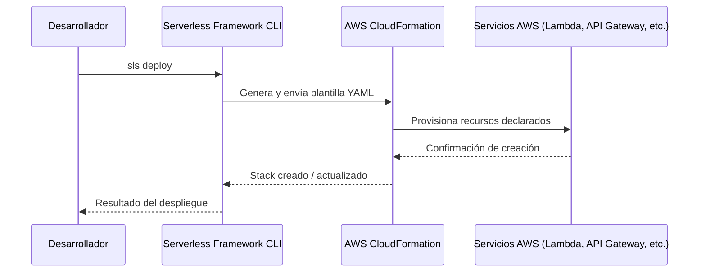
#### Diagrama
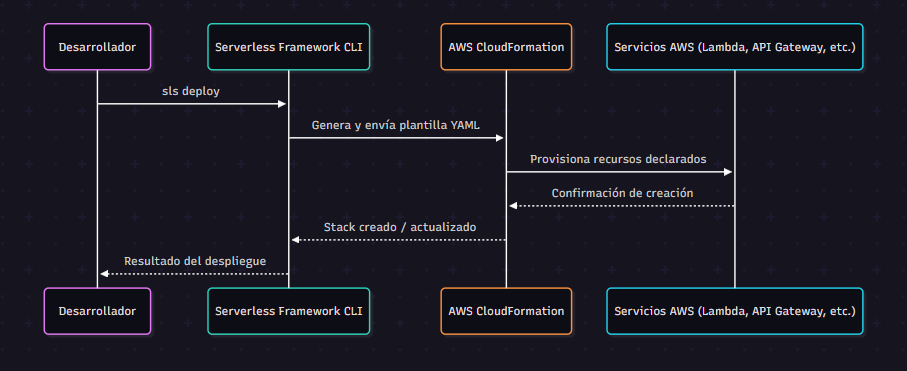

### 8. AWS CloudFormation

- **Qué es**: Servicio nativo de AWS para definir y provisionar infraestructura como código.
- **Casos de uso**: Declarar recursos (Lambdas, colas, tablas, APIs) en plantillas YAML/JSON.
- **Ventajas**: Control de cambios, versionado, integración con CI/CD.
- **Ejemplo**: Crear una plantilla YAML con recursos → CloudFormation los provisiona y gestiona cambios.

    >💡 *CloudFormation permite gestionar toda la infraestructura AWS como código, garantizando reproducibilidad y trazabilidad de cambios.*

    >ℹ️ *Dato adicional: AWS CDK (Cloud Development Kit) permite escribir esa infraestructura como código usando lenguajes como TypeScript o Python. El CDK genera plantillas de CloudFormation por debajo*

#### Mermaid

#### Diagrama
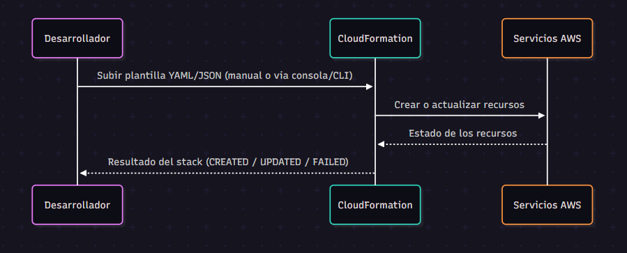

---

### 🆚 Comparación entre Serverless Framework y CloudFormatio : 
Tanto `Serverless Framework` como `CloudFormation` permiten definir infraestructura como código, pero con enfoques diferentes:

- ***CloudFormation*** es el motor nativo de AWS, donde se describe cada recurso manualmente en YAML o JSON.
- ***Serverless Framework*** es un framework externo que se abstrae de muchos detalles y genera internamente plantillas de `CloudFormation` por nosotros. Es más enfocado a aplicaciones serverless, con una sintaxis más simple y rápida para desarrolladores.
    
    > 📑 *En resumen: Serverless Framework simplifica y automatiza el uso de CloudFormation.*
